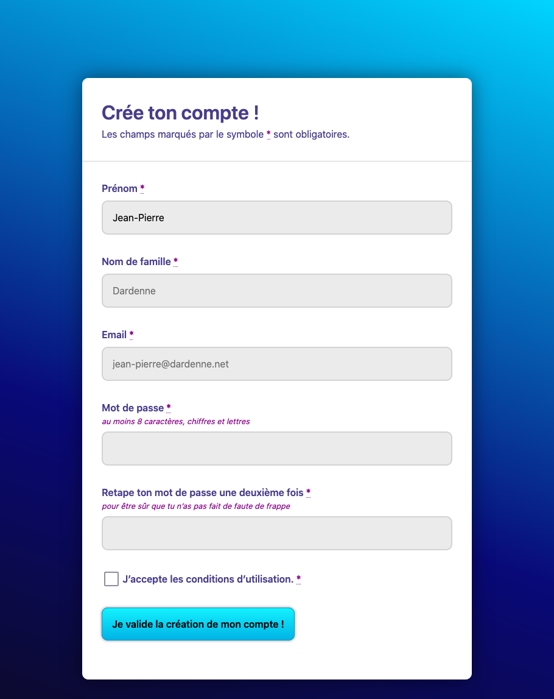

# html-form-signup

> HTML exercise about forms

* * *

**html-form-signup** is an educational project, which will be used for HTML courses.

**Note:** the school where the course is given, the [HEPL](http://www.hepl.be) from Liège, Belgium, is a french-speaking school. From this point, the instruction will be in French. Sorry.

* * *

## Exercice intégratif sur la balise `form` et les différents `input`

Créez le fichier `index.html` avec les bonnes balises afin d'arriver au résultat suivant :

